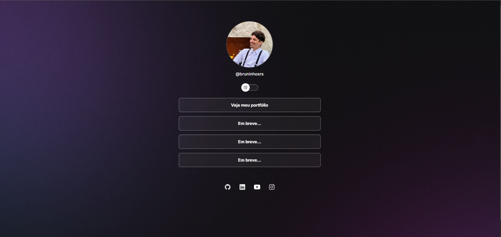
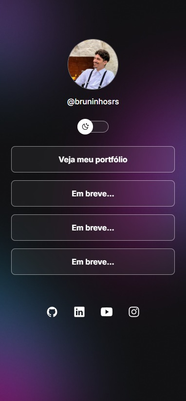

<h1 align="center"> Projeto Discover </h1>

Programa exclusivo e gratuito, promovido pela Rocketseat para ensino de tecnologias WEB.  

 

  
  

## 🚀 Tecnologias

Esse projeto foi desenvolvido com as seguintes tecnologias:

- HTML e CSS
- JavaScript
- Vite.js
- Git e Github
- Figma

## 💻 Projeto

O Projeto Discover é um agregador de links para usar como cartão de visitas online.

- [Acesse o projeto finalizado, online.](https://bruninhosrs.github.io/projeto-discover/)

## 🎯 Meus Aprendizados

Durante o desenvolvimento deste projeto, pude aprimorar meus conhecimentos em:

- Modo Light;
- Usar algumas funcionalidades do flex, flex-direction na sessão da lista;
- Animações no botão que faz com que a transição de mudar do dark-mode para o light-mode;
- Funções no JavaScript, fazer as manipulações do DOM, como clicar no botão e mudar os mode e mudar de foto;
- Ajustar a estilização da foto pelo JavaScript, eu já sabia, porém reelembrando novamente como se faz;
- Que existe um jeito muito mais fácil de mudar o mode (cor) da página;
- Pude aprender mais sobre o Vite.js, não foi utilizado a ferramenta nas aulas;
- Pude aprender como utilizar a ferramenta Figma, nunca tinha utilizado e me supreendi como ficou muito mais fácil para criações de <section> e 
.
